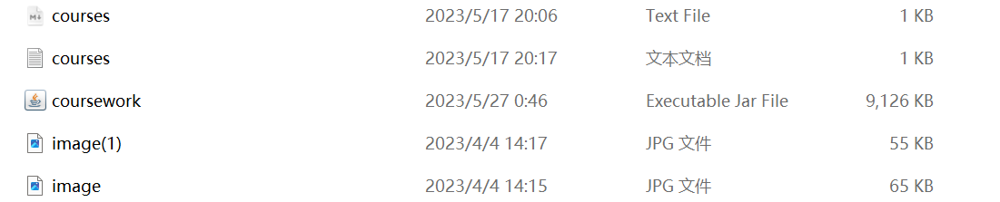
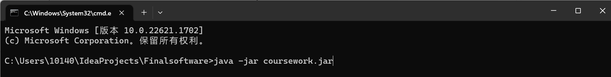

# Software-project
# Environment 
> JDK version: jdk-17.0.2 
> Operation System: Windows 11 
# Running
> You are supposed to enter the working directory that contains those files and the jar file is included in them. 
 
> This is a software program that can be run by executing the following steps:

1. **Click the JAR File**: Double-click on the `coursework.jar` file to open the software.

2. **Command Line Execution**: Alternatively, you can use the following command to run the software from the command line:
 
> This software package contains images and texts that are stored in the same package as the .jar file. They can be found in the "Finalsoftware" package.
